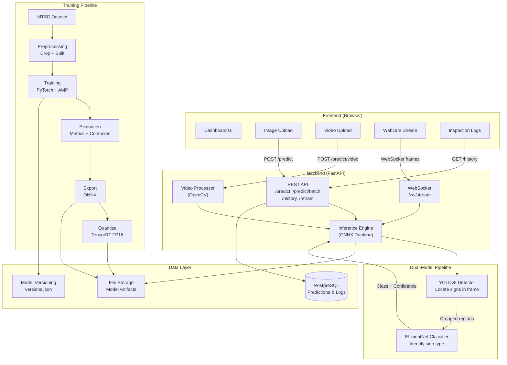

# Architecture

## System Architecture

## Component Details

### Frontend
- **Technology**: TypeScript + HTML + CSS
- **Tabs**: Image Upload, Video Analysis, Live Camera, Inspection Logs
- **Communication**: REST API for images/history, WebSocket for real-time camera

### Backend
- **Framework**: FastAPI (Python 3.11)
- **Inference**: ONNX Runtime with optional TensorRT backend
- **Video**: OpenCV for frame extraction and annotation
- **Database**: PostgreSQL via SQLAlchemy (async)

### ML Pipeline
- **Detection**: YOLOv8n/s fine-tuned on Mapillary MTSD
- **Classification**: EfficientNet-B0 with transfer learning
- **Optimization**: ONNX export → TensorRT FP16/INT8 quantization
- **Target**: >95% accuracy, ~60 FPS inference
