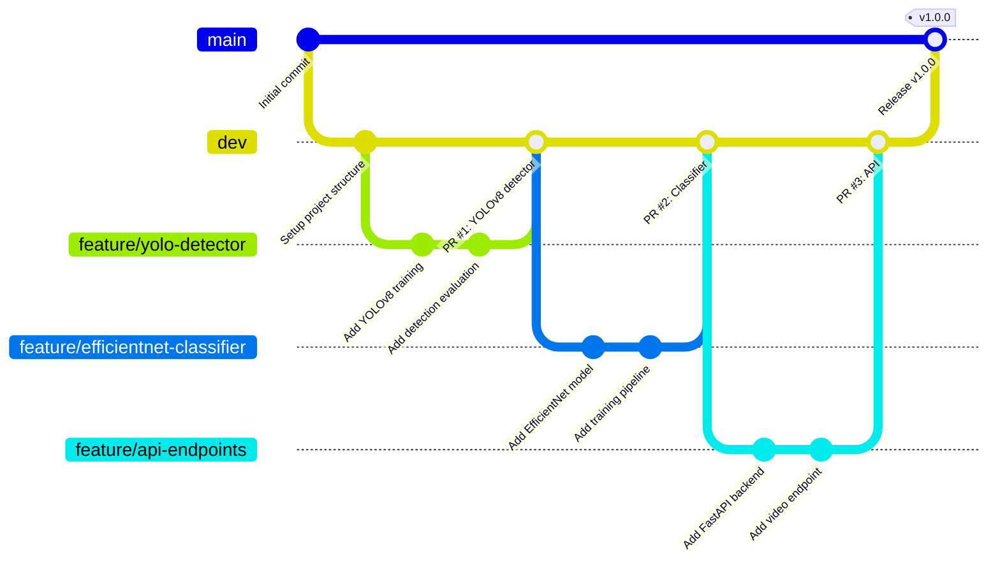

# Branch Strategy

## Branch Layout

## Branch Purposes

| Branch           | Purpose                        | Merges Into | Protection         |
|------------------|--------------------------------|-------------|---------------------|
| `main`           | Production releases            | —           | Protected, PR only  |
| `dev`            | Integration & testing          | `main`      | PR required         |
| `feature/*`      | Individual feature work        | `dev`       | No restrictions     |
| `hotfix/*`       | Critical production fixes      | `main`+`dev`| PR required         |

## Workflow

1. **New feature**: Branch `feature/xyz` from `dev`
2. **Development**: Commit to feature branch, push regularly
3. **Pull Request**: Open PR from `feature/xyz` → `dev`
4. **CI checks**: Linting, type checks, tests must pass
5. **Code review**: At least 1 approval required
6. **Merge**: Squash merge into `dev`
7. **Release**: When `dev` is stable, merge `dev` → `main` with a release tag

## Model Artifacts

Model files (`.onnx`, `.engine`) are **NOT** stored in git. Instead:
- Tracked via `ml/models/versions.json` (committed)
- Actual files stored in cloud storage or Docker volumes
- `version_manager.py` handles versioning and rollback

## Naming Conventions

- Feature branches: `feature/short-description` (e.g., `feature/video-streaming`)
- Hotfix branches: `hotfix/issue-description`
- Release tags: `v1.0.0` (semantic versioning)
- Commit messages: Conventional Commits (`feat:`, `fix:`, `docs:`, `chore:`)
