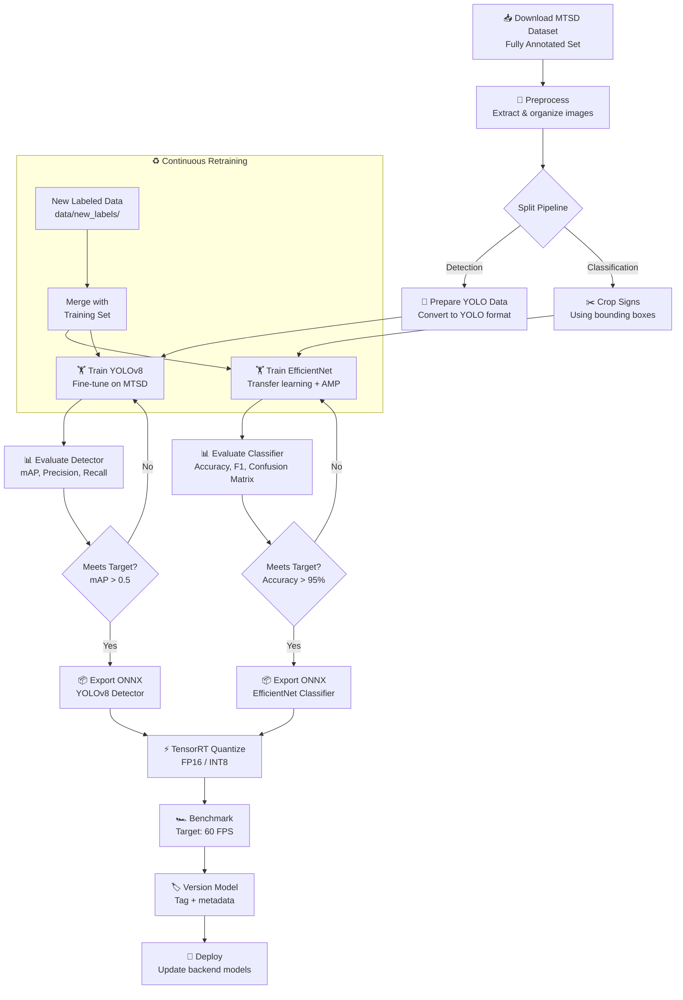

# Training Workflow

## End-to-End Pipeline

## Training Configuration

| Parameter         | EfficientNet          | YOLOv8               |
|-------------------|-----------------------|----------------------|
| **Input Size**    | 224 × 224             | 640 × 640            |
| **Batch Size**    | 64                    | 16                   |
| **Optimizer**     | AdamW                 | SGD (ultralytics)    |
| **Scheduler**     | CosineAnnealingLR     | Cosine (built-in)    |
| **Epochs**        | 50 (early stopping)   | 100                  |
| **Precision**     | Mixed (AMP)           | FP16                 |
| **Augmentation**  | Rotation, Jitter, Blur| Mosaic, MixUp, HSV   |

## Retraining Trigger

1. New labeled images placed in `data/new_labels/`
2. `POST /retrain` endpoint or `python ml/retrain.py`
3. Pipeline merges new data → retrains → re-exports → versions
